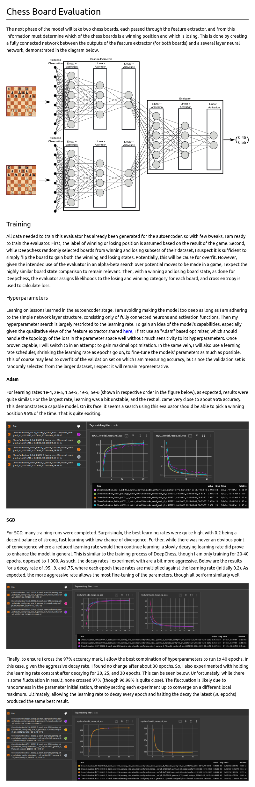
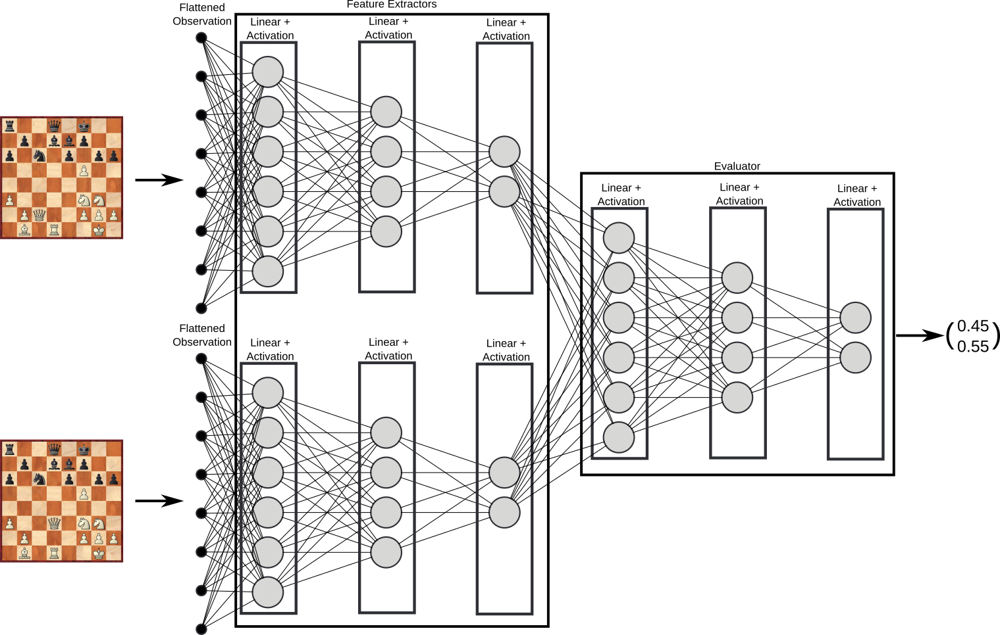

# Reinforcement Learning - Chess Engine
This is a reinforcement learning exploration by way of chess engine. My hope is to incorporate
many algorithms and strategies, and that the game of chess serves as a basis to compare them. I
intend to tend toward more automatic algorithms with the aim to understand and develop more 
general algorithms, over specialized chess infrastructure. Some specialization will be unavoidable
but should be done in a fashion analogous to techniques applied in other areas.

To best learn, emphasis will be on result analysis and process automation.

# Analysis
All analysis completed can be found [here](./my_chess/analysis/analysis.md). A highlight of the latest work
is below:

## Latest

# Automation
Training will be supported by Ray's RLlib "offering support for production-level, highly distributed
RL workloads while maintaining unified and simple APIs for a large variety of industry applications".
Models will be built with a PyTorch infrastructure.

# Models
The hope throughout this project is to iteratively improve upon a functioning chess machine. This means small tweaks to model infrastructure as well as replacing components entirely to incorporate and test new ideas.

## Initial
Inspired by DeepChess1, the initial model is made up of a feature extractor which feeds an evaluator of chess board states. This allows a classic alpha-beta search using the evaluator which compares two positions. The feature extractor and evaluator are both simply feed-forward fully-connected neural networks, where the alpha-beta search is an AI search technique where no learning is required, but clever problem structuring controls the combinatorial explosion of possible chess positions. Below is a diagram of the evaluation model.

# References:
1. David, O., Netanyahu, N., & Wolf, L. (2016). DeepChess: End-to-End Deep Neural Network for Automatic Learning in Chess. Springer International Publishing.