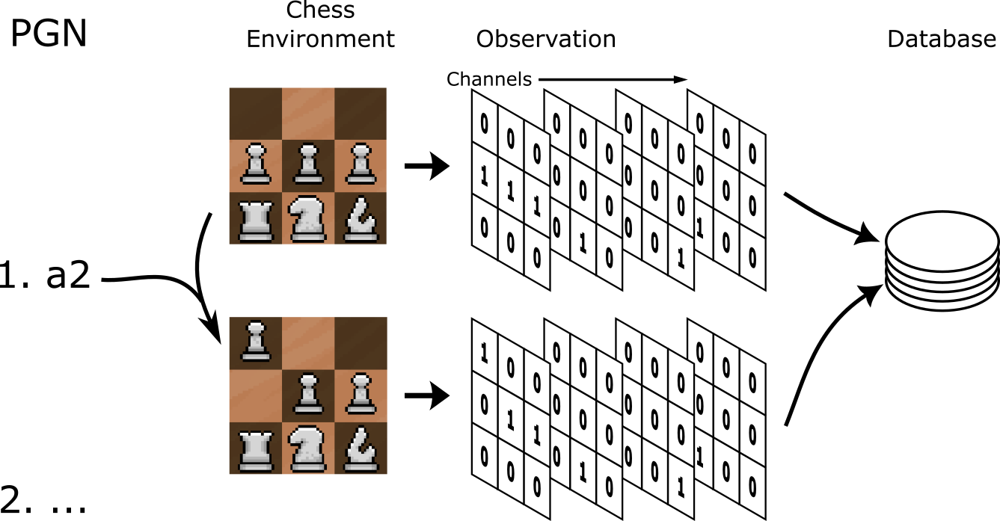

.. _data:

Data
===============

Data Engineering
------------------
The goal of the database supporting our chess bot is to have a large number of 
examples from strong players. Further, it is important that the data is
easily understood by a machine. Then it is adequate to obtain millions of
chess board positions reached by high Elo players where the outcome of the game
is known. The board positions can then effectively be represented as a series of
yes of no statements, mostly regarding each piece and its position within the 8x8
chess board.

Data Gathering
^^^^^^^^^^^^^^^
To achieve so many board positions from high Elo players,
`Computer Chess Rating Lists <http://computerchess.org.uk/ccrl/404/index.html>`_
records millions of games from top chess engines in Portable Game Notation (PGN)
format. These are freely available for download in a compressed format.

Data Preprocessing
^^^^^^^^^^^^^^^^^^^^^^^^
Getting the board positions necessary requires recreating the games played per 
the PGN files. PettingZoo :cite:`terry2021pettingzoo` includes a chess environment. This environment
provides observations of the state of the chess board. The specifics can be
found `here <https://pettingzoo.farama.org/environments/classic/chess/>`_. In
short, the observation is a set of board representations, also referred to as 
channels. Each representation is an 8x8 matrix of zeros and ones,
'no's and 'yes's, with respect to a specific piece of information, like
"are there white pawns in this position". There are a few pieces of information
worth clarifying from the PettingZoo documentation so I will include the
channel specifications here:

.. dropdown:: PettingZoo Chess Observation Channels

    +-----------+-------------------------------------+---------------------------------------------------------+
    | Channel   | Information                         |  Specification                                          |
    +===========+=====================================+=========================================================+
    |  0        | Can white castle queenside?         | Non-positional, all ones or all zeros                   |
    +-----------+-------------------------------------+---------------------------------------------------------+
    |  1        | Can white castle kingside?          | Non-positional, all ones or all zeros                   |
    +-----------+-------------------------------------+---------------------------------------------------------+
    |  2        | Can black castle queenside?         | Non-positional, all ones or all zeros                   |
    +-----------+-------------------------------------+---------------------------------------------------------+
    |  3        | Can black castle kingside?          | Non-positional, all ones or all zeros                   |
    +-----------+-------------------------------------+---------------------------------------------------------+
    |  4        | Is white or black observing?        | Non-positional, all ones(black) or all zeros(white)     |
    +-----------+-------------------------------------+---------------------------------------------------------+
    |  5        | 50 move rule count.                 | One in position of 8x8 matrix flattened to 1 dimension  |
    +-----------+-------------------------------------+---------------------------------------------------------+
    |  6        | All ones.                           |                                                         |
    +-----------+-------------------------------------+---------------------------------------------------------+
    |  7        | Where are the observer's pawns?     |                                                         |
    +-----------+-------------------------------------+---------------------------------------------------------+
    |  8        | Where are the observer's knights?   |                                                         |
    +-----------+-------------------------------------+---------------------------------------------------------+
    |  9        | Where are the observer's bishops?   |                                                         |
    +-----------+-------------------------------------+---------------------------------------------------------+
    |  10       | Where are the observer's rooks?     |                                                         |
    +-----------+-------------------------------------+---------------------------------------------------------+
    |  11       | Where are the observer's queens?    |                                                         |
    +-----------+-------------------------------------+---------------------------------------------------------+
    |  12       | Where is the observer's king?       |                                                         |
    +-----------+-------------------------------------+---------------------------------------------------------+
    |  13       | Where are the opponent's pawns?     |                                                         |
    +-----------+-------------------------------------+---------------------------------------------------------+
    |  14       | Where are the opponent's knights?   |                                                         |
    +-----------+-------------------------------------+---------------------------------------------------------+
    |  15       | Where are the opponent's bishops?   |                                                         |
    +-----------+-------------------------------------+---------------------------------------------------------+
    |  16       | Where are the opponent's rooks?     |                                                         |
    +-----------+-------------------------------------+---------------------------------------------------------+
    |  17       | Where are the opponent's queens?    |                                                         |
    +-----------+-------------------------------------+---------------------------------------------------------+
    |  18       | Where is the opponent's king?       |                                                         |
    +-----------+-------------------------------------+---------------------------------------------------------+
    |  19       | Has this position been seen before? | Non-positional, all ones or all zeros                   |
    +-----------+-------------------------------------+---------------------------------------------------------+
    |  20-110   | Repeats of 7-19 for the 7 most      | From most recent to least.                              |
    |           | recent positions.                   |                                                         |
    +-----------+-------------------------------------+---------------------------------------------------------+

To create the database then is a matter of submitting the moves described in the
PGN file to the environment, saving observations with appropriate labels all the
while.

Further, the database is refined to concentrate on more relevant datapoints. On 
advice provided by :cite:t:`David_2016`, this includes avoiding positions very
early in the game (first 5 moves), positions immediately after the capture of a
piece, and games which ended in a draw.

The Stats
^^^^^^^^^^^^
+-----------------------------+-------------------------------------+
| Measure                     | Value                               |
+=============================+=====================================+
|  Number of games processed  | 300,000                             |
+-----------------------------+-------------------------------------+
|  Size of games processed    |  0.3 GB                             |
+-----------------------------+-------------------------------------+
|  Number of observations     | 5,875,812                           |
+-----------------------------+-------------------------------------+
|  Size of labels             |  2.0 GB                             |
+-----------------------------+-------------------------------------+
|  Size of observations       | 69.0 GB                             |
+-----------------------------+-------------------------------------+

The Tricky Bit
^^^^^^^^^^^^^^^^

The size of the database is considerable. This makes the games difficult to parse
and the observation data difficult to fit onto RAM all at once.

To address the difficulty of parsing over 1M games (necessary even when limiting
the database to 300,000 games to avoid draws), I created a custom iterator which
leverages python's Pandas library. This iterator combined with a multiprocess
mapping ensures the database is created quickly with efficient use of compute
power and memory. Each process will save the observations to the hard drive
while accumulating observation label information in RAM up to some specified 
limit (14,000 games in my case). The label information is then also saved to the
hard drive with a master file keeping track of which label files contain
the metadata for which observations (e.g. label_file_1 contains metadata for
the first 200,000 observations). This procedure allows the database to easily
scale, dependent on the available games supplied by PGN file, the available RAM,
and the available hard drive space.

This also addresses the second issue of fitting all observation data into RAM at
once. The label files which contain the metadata for the observations, including
their location on the hard drive, can then be loaded one at a time and have all
their observations processed before moving on to the next set of observations 
represented by the next label file.

This is complicated somewhat by the idea that the GPU used to train our model
will be much faster at processing than the CPU loading data from the hard drive.
This means it is prudent to enable multiprocessing and batching when loading the
data to be trained on. To ensure RAM usage is stable:

#. Indices must be served in order. So if selected randomly, as with a data
   split, those selected must be sorted.
#. Two label files should be in RAM, where one fails to complete a batch, the 
   next can take over.
#. Once the end of a label file is reached, a lock should be used to pause all
   but one process which handles opening the next label file (and closing the
   oldest one).
#. Since Pytorch's :cite:p:`Ansel_PyTorch_2_Faster_2024` dataloader is
   being used, special considerations must be made in how data labels are stored,
   avoiding lists and dicts, described in detail in my repository
   `documentation <https://mzimm003.github.io/Chess/documentation/build/html/_autosummary/my_chess.learner.datasets.dataset.Dataset.html>`_.

