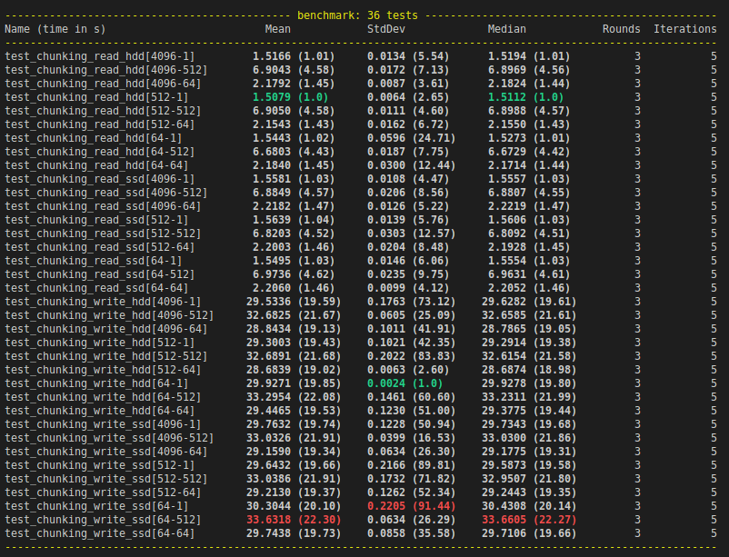
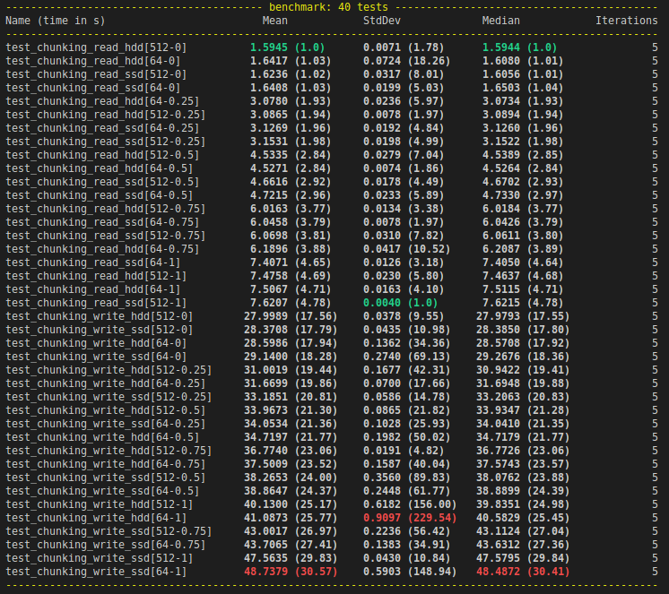
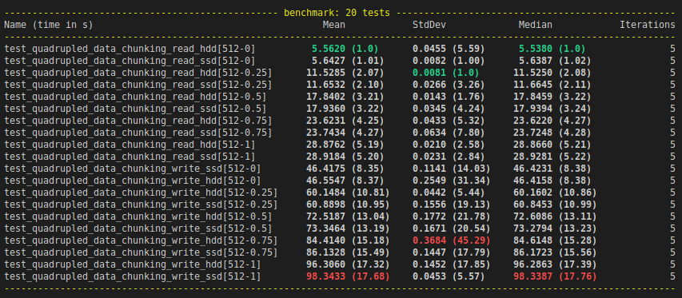
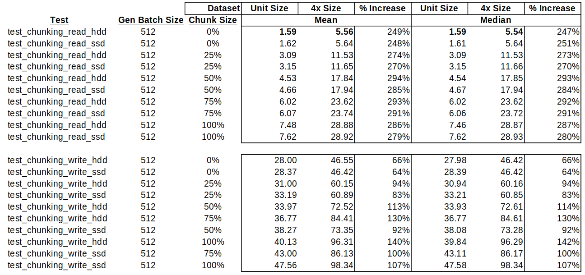

.. _data:

Data
===============

Data Engineering
------------------
The goal of the database supporting our chess bot is to have a large number of 
examples from strong players. Further, it is important that the data is
easily understood by a machine. Then it is adequate to obtain millions of
chess board positions reached by high Elo players where the outcome of the game
is known. The board positions can then effectively be represented as a series of
yes of no statements, mostly regarding each piece and its position within the 8x8
chess board.

Data Gathering
^^^^^^^^^^^^^^^
To achieve so many board positions from high Elo players,
`Computer Chess Rating Lists <http://computerchess.org.uk/ccrl/404/index.html>`_
records millions of games from top chess engines in Portable Game Notation (PGN)
format. These are freely available for download in a compressed format.

Data Preprocessing
^^^^^^^^^^^^^^^^^^^^^^^^
Getting the board positions necessary requires recreating the games played per 
the PGN files. PettingZoo :cite:`terry2021pettingzoo` includes a chess environment. This environment
provides observations of the state of the chess board. The specifics can be
found `here <https://pettingzoo.farama.org/environments/classic/chess/>`_. In
short, the observation is a set of board representations, also referred to as 
channels. Each representation is an 8x8 matrix of zeros and ones,
'no's and 'yes's, with respect to a specific piece of information, like
"are there white pawns in this position". There are a few pieces of information
worth clarifying from the PettingZoo documentation so I will include the
channel specifications here:

.. dropdown:: PettingZoo Chess Observation Channels

    +-----------+-------------------------------------+---------------------------------------------------------+
    | Channel   | Information                         |  Specification                                          |
    +===========+=====================================+=========================================================+
    |  0        | Can white castle queenside?         | Non-positional, all ones or all zeros                   |
    +-----------+-------------------------------------+---------------------------------------------------------+
    |  1        | Can white castle kingside?          | Non-positional, all ones or all zeros                   |
    +-----------+-------------------------------------+---------------------------------------------------------+
    |  2        | Can black castle queenside?         | Non-positional, all ones or all zeros                   |
    +-----------+-------------------------------------+---------------------------------------------------------+
    |  3        | Can black castle kingside?          | Non-positional, all ones or all zeros                   |
    +-----------+-------------------------------------+---------------------------------------------------------+
    |  4        | Is white or black observing?        | Non-positional, all ones(black) or all zeros(white)     |
    +-----------+-------------------------------------+---------------------------------------------------------+
    |  5        | 50 move rule count.                 | One in position of 8x8 matrix flattened to 1 dimension  |
    +-----------+-------------------------------------+---------------------------------------------------------+
    |  6        | All ones.                           |                                                         |
    +-----------+-------------------------------------+---------------------------------------------------------+
    |  7        | Where are the observer's pawns?     |                                                         |
    +-----------+-------------------------------------+---------------------------------------------------------+
    |  8        | Where are the observer's knights?   |                                                         |
    +-----------+-------------------------------------+---------------------------------------------------------+
    |  9        | Where are the observer's bishops?   |                                                         |
    +-----------+-------------------------------------+---------------------------------------------------------+
    |  10       | Where are the observer's rooks?     |                                                         |
    +-----------+-------------------------------------+---------------------------------------------------------+
    |  11       | Where are the observer's queens?    |                                                         |
    +-----------+-------------------------------------+---------------------------------------------------------+
    |  12       | Where is the observer's king?       |                                                         |
    +-----------+-------------------------------------+---------------------------------------------------------+
    |  13       | Where are the opponent's pawns?     |                                                         |
    +-----------+-------------------------------------+---------------------------------------------------------+
    |  14       | Where are the opponent's knights?   |                                                         |
    +-----------+-------------------------------------+---------------------------------------------------------+
    |  15       | Where are the opponent's bishops?   |                                                         |
    +-----------+-------------------------------------+---------------------------------------------------------+
    |  16       | Where are the opponent's rooks?     |                                                         |
    +-----------+-------------------------------------+---------------------------------------------------------+
    |  17       | Where are the opponent's queens?    |                                                         |
    +-----------+-------------------------------------+---------------------------------------------------------+
    |  18       | Where is the opponent's king?       |                                                         |
    +-----------+-------------------------------------+---------------------------------------------------------+
    |  19       | Has this position been seen before? | Non-positional, all ones or all zeros                   |
    +-----------+-------------------------------------+---------------------------------------------------------+
    |  20-110   | Repeats of 7-19 for the 7 most      | From most recent to least.                              |
    |           | recent positions.                   |                                                         |
    +-----------+-------------------------------------+---------------------------------------------------------+

To create the database then is a matter of submitting the moves described in the
PGN file to the environment, saving observations with appropriate labels all the
while.

.. image:: figures/dataProcessing.png
    :scale: 35%
    :align: center

Further, the database is refined to concentrate on more relevant datapoints. On 
advice provided by :cite:t:`David_2016`, this includes avoiding positions very
early in the game (first 5 moves), positions immediately after the capture of a
piece, and games which ended in a draw.

The Stats
^^^^^^^^^^^^
+-----------------------------+-------------------------------------+
| Measure                     | Value                               |
+=============================+=====================================+
|  Number of games processed  | 300,000                             |
+-----------------------------+-------------------------------------+
|  Size of games processed    |  0.3 GB                             |
+-----------------------------+-------------------------------------+
|  Number of observations     | 5,875,812                           |
+-----------------------------+-------------------------------------+
|  Size of labels             |  2.0 GB                             |
+-----------------------------+-------------------------------------+
|  Size of observations       | 69.0 GB                             |
+-----------------------------+-------------------------------------+

The Tricky Bit
^^^^^^^^^^^^^^^^

The size of the database is considerable. This makes the games difficult to parse
and the observation data difficult to fit onto RAM all at once.

To address the difficulty of parsing over 1M games (necessary even when limiting
the database to 300,000 games to avoid draws), I created a custom iterator which
leverages python's Pandas library. This iterator combined with a multiprocess
mapping ensures the database is created quickly with efficient use of compute
power and memory. Each process will save the observations to the hard drive
while accumulating observation label information in RAM up to some specified 
limit (14,000 games in my case). The label information is then also saved to the
hard drive with a master file keeping track of which label files contain
the metadata for which observations (e.g. label_file_1 contains metadata for
the first 200,000 observations). This procedure allows the database to easily
scale, dependent on the available games supplied by PGN file, the available RAM,
and the available hard drive space.

This also addresses the second issue of fitting all observation data into RAM at
once. The label files which contain the metadata for the observations, including
their location on the hard drive, can then be loaded one at a time and have all
their observations processed before moving on to the next set of observations 
represented by the next label file.

This is complicated somewhat by the idea that the GPU used to train our model
will be much faster at processing than the CPU loading data from the hard drive.
This means it is prudent to enable multiprocessing and batching when loading the
data to be trained on. To ensure RAM usage is stable:

#. Indices must be served in order. So if selected randomly, as with a data
   split, those selected must be sorted.
#. Two label files should be in RAM, where one fails to complete a batch, the 
   next can take over.
#. Once the end of a label file is reached, a lock should be used to pause all
   but one process which handles opening the next label file (and closing the
   oldest one).
#. Since Pytorch's :cite:p:`Ansel_PyTorch_2_Faster_2024` dataloader is
   being used, special considerations must be made in how data labels are stored,
   avoiding lists and dicts, described in detail in my repository
   `documentation <https://mzimm003.github.io/Chess/documentation/build/html/_autosummary/my_chess.learner.datasets.dataset.Dataset.html>`_.

Database Upgrade
^^^^^^^^^^^^^^^^^^^
To expand the abilities of the dataset to include things like an oracle value,
relevant to bots based on the workings of
:cite:t:`ruoss2024grandmasterlevelchesssearch`, I pivot the database
infrastructure to rely on HDF5, opposed to a home crafted solution. As rewarding
as overcoming obstacles in the home crafted solution was, see
:ref:`dataloading`, the switch allows for greater control in memory management
via a more developed chunking method, and features like compression. With finer
chunking and compression I may be able to better leverage the bigger but slower
HDD of my system, supporting larger datasets.

An important consideration for read and write speed in the HDF5 system is chunk
size. Further, since I am processing games in parallel to create observations,
the database will be written to in batches, where larger batches are expected
to enhance speed though the effect may be capped as soon as a batch size
is reached which fully engages the CPU.

To determine the appropriate settings, some benchmarks are run with various
combinations of chunk size and generation batch size. These will capture timings
both for read and write speed for the database. Additionally, tests will be run
on the HDD and the SSD hard drives to determine whether any configuration can
make the speeds of the HDD comparable to the SSD, particularly when reading
data. The results are below:

.. _hdf5-benchmark:

   Dataset creation and use timings by [generation batch size - chunk size].

:numref:`hdf5-benchmark` shows the ideal chunk size is 1. Write speed is
slightly improved with a greater size, but not by much. As the data will be read
many more times than it will be written, the differences in reading are more
encouraging. For reading, the generation batch size should have no bearing, as
it is not a process that exists when reading a created dataset. For writing, it
still seems to have minimal impact, though 64 does come out slightly worse.
Then, to perform as well as possible, while being considerate of RAM, a
generation batch size of 512 is reasonable. Finally, there is very little
difference in SSD or HDD storage. I am unsure why this would be, and will
require further research. Possibly, other bottlenecks exist allowing the two to
perform similarly. For now, it is encouraging I can rely on my higher capacity
storage solution.

Further investigation reveals the static chunk size leads to memory leak issues.
The chunk size is setup only to control the dimension separating data points.
When the data points are 8x8x111 boolean vectors, this can make sense, as a
single chunk would contain enough data to fall within h5py's recommendation
that chunk sizes should be "between 10 KiB and 1 MiB, larger for larger
datasets." However, other datasets capturing aspects like which color won, or 
filtering mechanisms stored as uint32, being only 4 bytes per item, are much 
smaller than recommended at a chunk size of 1. Moreover, this small size 
actually creates a memory leak like issue when attempting to access the entire
database. So, a more dynamic chunking process can be achieved by specifically
shooting for the recommended range base on the item size and shape of the data
point containing those items.

Determining chunk shapes by data size results in the timings found in
:numref:`hdf5-chunk-as-ratio-benchmark`. Again, generation batch size has
minimal impact as long as it is big enough (larger than 64), so 512 seems
appropriate. Then timings largely depend on chunk size, which follows the
pattern, smaller is faster. Best timings are achieved at an aim of 10 KiB
the small end of the recommended range.

.. _hdf5-chunk-as-ratio-benchmark:

   Dataset creation and use timings by [generation batch size - chunk size].
   Chunk size represents where on the scale of 10-1024 KiB the size is.

The h5py library also recommends larger chunk sizes for larger datasets. Since
this is a rule of thumb, but not necessarily specific to the chess database
being created or how its read, this will be reviewed empirically. The PGN
files being used to benchmark the read and write timings are copied to
quadruple the amount of data being processed. 
:numref:`hdf5-chunk-as-ratio-large-benchmark` shows the trend continues,
smaller is faster, so a generation batch size of 512 and chunk size aiming for
10 KiB will be used.

.. _hdf5-chunk-as-ratio-large-benchmark:

   Dataset creation and use timings by [generation batch size - chunk size].
   Chunk size represents where on the scale of 10-1024 KiB the size is.

As the quadrupled data is still far less than the size of the intended dataset,
to be more confident the trend will continue as the data grows greater still,
the variance increase should be considered as well as the absolute shortest
time. :numref:`HDF5-benchmark-comparison-table` shows the timings between 
the original dataset and quadrupled. Not only is the smallest chunk size
fastest, it has the smallest increase in time as the dataset grew. This is still
no guarantee, but provides some confidence the small chunk size will be optimal.
Of course, beyond speed, the smallest chunk size also affords the greatest
ability to manage RAM as the dataset is used for training or trainings. It is
also confirmed the memory leak issue is resolved with the new dynamic
batch shape strategy.

.. _HDF5-benchmark-comparison-table:

   Dataset creation and use timings by [generation batch size - chunk size].
   Chunk size represents where on the scale of 10-1024 KiB the size is.
