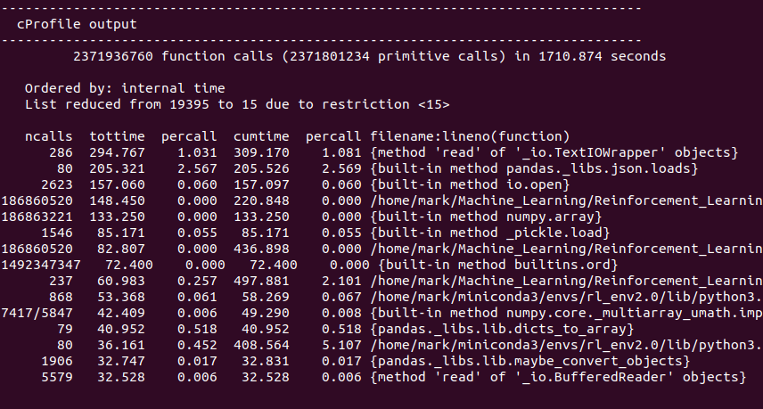
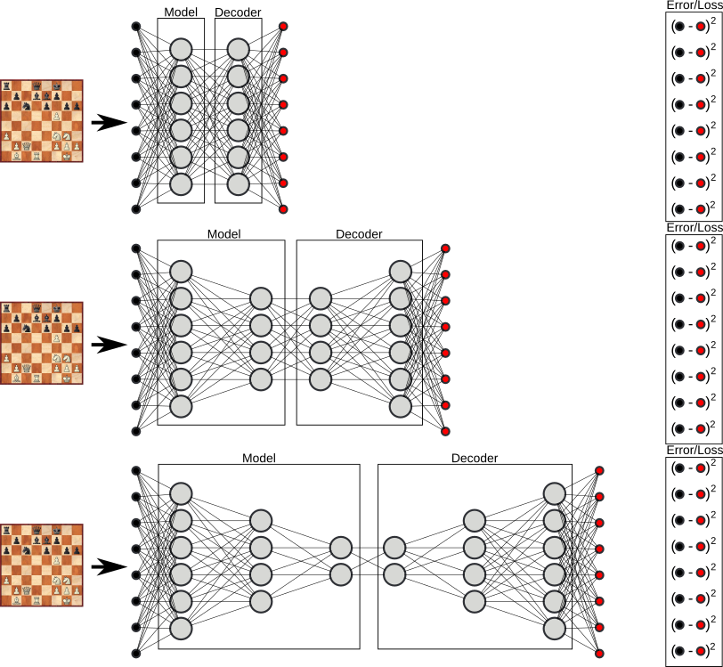

# Algorithm
To train a feature extractor for the observation space provided by Petting Zoo's chess environment I try to emulate the process provided by DeepChess1. To that end, my model is mirrored, layer by layer, to create a decoder version, such that the model and its decoder can be coupled as an auto encoder. The goal is to have a training set of board observations, which the model takes as input, abstracts to some smaller feature set, passes to the decoder then to reproduce the original observation. The more representative the feature set is of the board, the better the reproduction. This autoencoding then should produce a model which has developed a sense of what it is to be a chess position.

## Data
With 68 million observations, the chess board observations are plentiful. As DeepChess1 cites using around 2 million, I start there. I split the dataset randomly using 2.5% (1.7M) as training data, 0.05%(0.34M) as validation data, reserving the rest as test data. Unfortunately, even with this small fraction, 2M data points has proven substantial to iterate over, despite use of a batching of multiprocessing. Through research and profiling (see below) along with noting under utilization of bother the CPU and GPU, it is suspected the hard disk drive containing the data set is creating a bottleneck to the training process. Unfortunately, the available solid state drive is limited in size, and cannot fit the entire dataset. Therefor an attempt to copy only that data used in the training and validation set will be made to confirm these suspicions and advance the training process.

This profile of a script simply iterating a dataloader shows the top items which are costing time per call all surround input output, to the extent the total time of the relatively limited number of calls dwarfs the time taken for calls made millions of times. Improved input output speeds should lead to faster training.

To provide data samples on the solid state drive, the pgn file provided by http://computerchess.org.uk/ccrl/404/ are first parsed by game, and then a subsample of those games are processed. This limits the dataset randomness when creating the training, validation, and test sets as there are fewer games to choose from. The observations covered then will be less comprehensive. Hopefully with a large enough subset, this impact is limited. Ultimately a dataset of 11M observations was created for the solid state drive. For training times, this has been a huge improvement. CPU and GPU utilization is now near 100% for much of the training, and trainings take hours instead of days/weeks, indicating a successful identification and solution of this bottleneck.

## Model
To begin, the model will be similar to that provided by DeepChess1. The observation provided by the environment will be flattened, then used as input for a feedforward neural network. The network is straightforward in that it is fully connected, and is alternating linear and activation layers. The observation size is 8x8x111, or 7,104 when flattened. Then the layers of the feature extractor model should be smaller than this, but there is variability to the exact width and depth, a hyperparameter to be tuned. The logits of each layer will represent features extracted from the observation space. The features become increasingly abstract deeper in the model, as the layers become smaller. The goal then is to find a model which can condense the information on the board in the most meaningful way, initially measured by reconstruction error, described further in the next section. An example model is provided below.

## Auto Encoder Training
To train the feature extractor I will provide an auto encoding algorithm, where features are encoded by the model, then decoded by a mirror model. The aim then is an output between the two models of the input. By creating abstract features, information has been compressed. Depending on the effectiveness of the features, information is either preserved or destroyed in that compression. Then the effectiveness of the feature extraction can be measured by the reconstruction error between the output of the auto encoder (model and mirror model together). Specifically, using mean squared error, i.e. the difference between the output float values and input float values which both are meant to represent the board observation, I have a differentiable loss on which to train the auto encoder which contains my feature extracting model. Further, to aid in the propagation of information through the model, as provided by DeepChess1, the auto encoder is trained in parts. First, including only the first layer, then including the first two, and so on. The process is exampled below.

## References:
1. David, O., Netanyahu, N., & Wolf, L. (2016). DeepChess: End-to-End Deep Neural Network for Automatic Learning in Chess. Springer International Publishing.