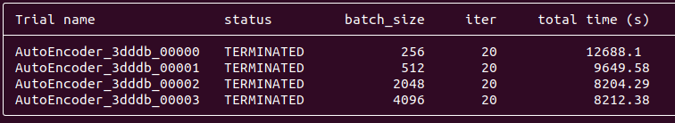
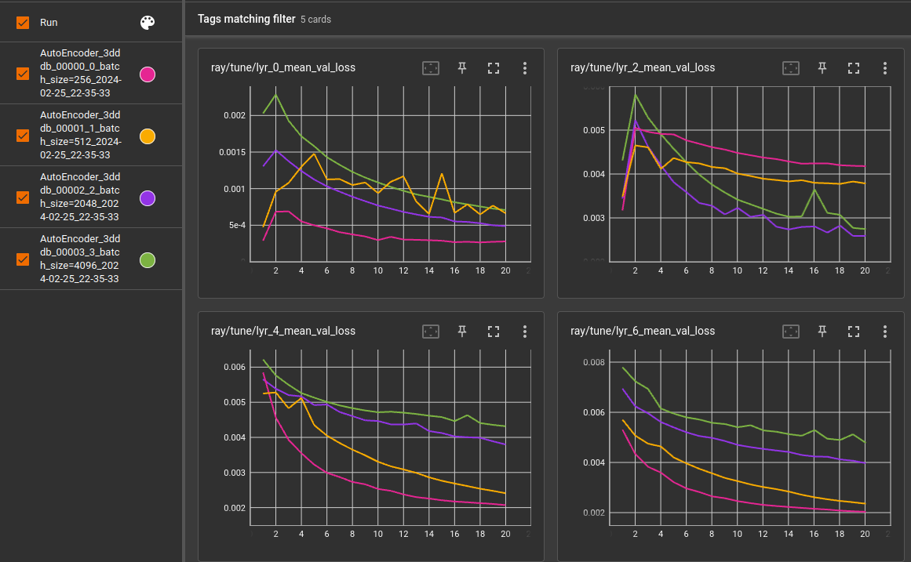

# Hyperparameter tuning
Now with reasonable training times I can consider how to create the best feature extractor per hyperparameters. Using Adam (adaptive moment estimation) optimization, the hyperparameters on which I will concentrate will include the optimizer's learning rate, along with the model's depth and layer widths, and the dataset's batch size. Adam is chosen for its ability to avoid saddle points in the loss-space, somewhat simplifying the training. Potentially other optimizers will be explored later to further fine tune the model.

# Batch Size and Learning Rate
Now with reasonable data loading times we can consider much larger batch sizes. This should come with the advantage of more stable learning, in that each optimization step will be considering a large sample size. From the chart just below I can also see larger batches come with time savings, to a point.

However, with the larger batch size we also experience fewer optimization steps, as one occurs for each batch. To that end, I also see higher loss values (greater error) which are much further from converging in the higher batch sizes. This is demonstrated in the charts just below, especially in the higher layer values, i.e. a more complete model (see [Training Setup](./analysis-0216-TrainingSetup.md) for more detail).

 To address this I can increase the learning rate, compensating for the fewer optimization steps. This unfortunately leads to instability before ever achieving results similar to the small batch sizes, seen here:

 I could potentially address this with a greater number of training epochs, but this seems to defeat the time saving advantage the large batch size provides. I might also use a decaying learning rate, but to keep things straight forward and stable, the smaller batch size already seems to provide what's necessary. Then going forward, in comparing models I will use a batch size of 256 and a learning rate of 0.0001.

# Model Size
The model size controls feature extraction in that abstract features inferred late in the model must be well-informed by simpler features early in the model. Thinking of a shape, I cannot know a square before I know a point, a line, a corner, an edge, etc. Then I think what's most important to determine in the model is whether for the chess board, are fine, intermediate, or the most abstract details most important, or are they all equally important. To answer this, I propose several shapes for which level widths shrink at varied rates to emphasize the different levels of feature abstraction:

|Shape|Shrink Rates|Emphasis|
|--|---|----|
|[4096, 2048, 1024, 512, 256, 128]|2,2,2,2,2|Even across all levels of abstraction|
|[4096, 2048, 512, 128]|2,4,4|Finer for early levels of abstraction|
|[4096, 1024, 256, 128]|4,4,2|Finer for later levels of abstraction|
|[4096, 1024, 512, 128]|2,4,2|Finer for intermediate levels of abstraction|
|[4096, 1024, 128]|4,8|Finer for early levels of abstraction|
|[4096, 512, 128]|8,4|Finer for later levels of abstraction|

With these shapes I also hope to control the depth of the model and demonstrate that with the right emphasis, a smaller model is sufficient and capable.