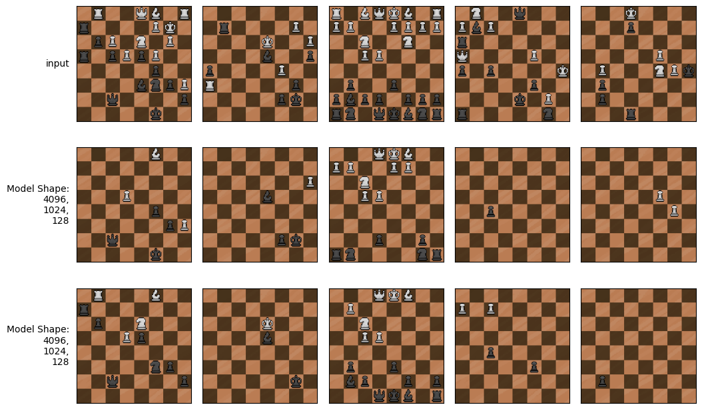

# Model Size
Each of the model sizes provided previously:

|Shape|Shrink Rates|Emphasis|
|--|---|----|
|[4096, 2048, 1024, 512, 256, 128]|2,2,2,2,2|Even across all levels of abstraction|
|[4096, 2048, 512, 128]|2,4,4|Finer for early levels of abstraction|
|[4096, 1024, 256, 128]|4,4,2|Finer for later levels of abstraction|
|[4096, 1024, 512, 128]|4,2,4|Finer for intermediate levels of abstraction|
|[4096, 1024, 128]|4,8|Finer for early levels of abstraction|
|[4096, 512, 128]|8,4|Finer for later levels of abstraction|

have been trained over 20 epochs.

## All Model Learning Curves
Unfortunately, the learning rate of 0.0001 ultimately proved high for the first, largest model, in that it caused unstable learning. So, for this model I chose a slightly smaller learning rate of 0.000025. This may disadvantage the model compared to the others, but ultimately is of less consequence than other issues holding back the larger models, to be discussed later.

The figure below considers all models, in order of the table above, with the initial run of the large model at lr=0.0001 not pictured, and its replacement run at lr=0.000025 at the bottom of the key. The key takeaways here are that the smaller the model the better the performance, and that most models are not done learning. The larger models are likely suffering simply for their complexity. It is expected they would ultimately perform better than smaller, being capable of creating more nuance, but may suffer from issues like a vanishing gradient through the layers. This should be managed to some extent by the layer-by-layer training procedure (see [Training Setup](./analysis-0216-TrainingSetup.md)), but might further be improved by introducing some normalization between layers as well.

## Learning Curves By Size

Considering the 4 layer models, I can see the most advantage is provided by concentrating on intermediate features. This suggests wasted resource with models overly concerned with observation relationships of the finest detail, yet lack of ability with models which attempt to jump beyond more elemental observation relationships.

For the smallest models, there is no option concentrating on intermediate levels, but again we see the model attempting to jump elemental relationships doing a bit worse. So, better to waste a bit of a resource to establish the necessary ability.

Since the smallest models did best from how the experiments have been conducted thus far, for the purposes of moving forward in the project. I will rely on the [4096, 1024, 128] model as my feature extractor. To give it the best chance I have also continued its training to 40 epochs, which did provide slow steady improvement as expected.

## Measurement peculiarities

Also of note in the graphs above, is the superb scores in accuracy, precision, and recall. These may be deceptive, and are best considered for relative values between models, opposed to thinking all models are working exceptionally well. This is due to the nature of the data being auto-encoded. The data is a 111x8x8 tensor of mostly zeros. The specifics of the data are provided by Petting Zoo [here](https://pettingzoo.farama.org/environments/classic/chess/). In short, each of the 111 channels mostly represent a single group of pieces, meaning on each slice, maybe 1 or 2 out of 64 cells are set to true. So even if the model created an empty tensor of 111x8x8 'false's, accuracy would be high. Further, some channels are there to represent player turn, or simply always be set to true for all 64 squares. These imbalances in what's being learned affect accuracy, precision, and recall. In the future it may be beneficial to split the observation being auto-encoded, and avoid making the model learn parts easily calculated.

## Qualitative analysis
Because of the issues described above, it is important to get a qualitative sense of the models' ability. For this I have sampled a few data points from the training and validation sets and mapped the current board state (channels 7-18). Below are the results of all models run, as well as a comparison between the best model at 20 and at 40 epochs.

### Auto-encoded Training Data

### Auto-encoded Validation Data

### Auto-encoded Training Data - Best Models

### Auto-encoded Validation Data - Best Models
