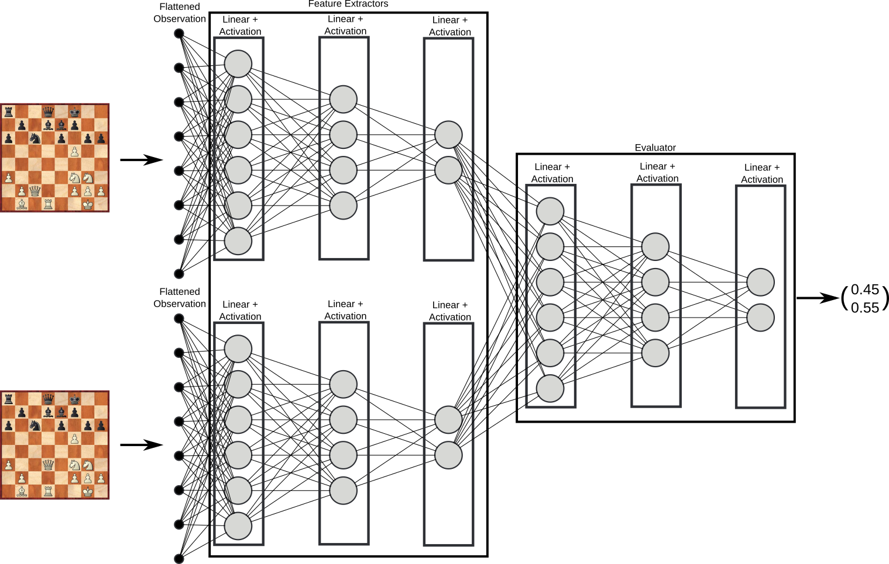

# Chess Board Evaluation
The next phase of the model will take two chess boards, each passed through the feature extractor, and from this information must determine which of the chess boards is a winning position and which is losing. This is done by creating a fully connected network between the outputs of the feature extractor (for both boards) and a several layer neural network, demonstrated in the diagram below.

## Training
All data needed to train this evaluator has already been generated for the autoencoder, so with few tweaks, I am ready to train the evaluator. First, the label of winning or losing position is assumed based on the result of the game. Second, while DeepChess randomly selected boards from winning and losing subsets of their dataset, I suspect it is sufficient to simply flip the board to gain both the winning and losing states. Potentially, this will be cause for overfit. However, given the intended use of the evaluator in an alpha-beta search over potential moves to be made in a game, I expect the highly similar board state comparison to remain relevant. Then, with a winning and losing board state, as done for DeepChess, the evaluator assigns likelihoods to the losing and winning category for each board, and cross entropy is used to calculate loss.

### Hyperparameters
Leaning on lessons learned in the autoencoder stage, I am avoiding making the model too deep as long as I am adhering to the simple network layer structure, consisting only of fully connected neurons and activation functions. Then my hyperparameter search is largely restricted to the learning rate. To gain an idea of the model's capabilities, especially given the qualitative view of the feature extractor shared [here](./analysis-0308-ModelSize.md), I first use an "Adam" based optimizer, which should handle the topology of the loss in the parameter space well without much sensitivity to its hyperparameters. Once proven capable, I will switch to in an attempt to gain maximal optimization. In the same vein, I will also use a learning rate scheduler, shrinking the learning rate as epochs go on, to fine-tune the models' parameters as much as possible. This of course may lead to overfit of the validation set on which I am measuring accuracy, but since the validation set is randomly selected from the larger dataset, I expect it will remain representative.

#### Adam
For learning rates 1e-4, 2e-5, 1.5e-5, 1e-5, 5e-6 (shown in respective order in the figure below), as expected, results were quite similar. For the largest rate, learning was a bit unstable, and the rest all came very close to about 96% accuracy. This demonstrates a capable model. On its face, it seems a search using this evaluator should be able to pick a winning position 96% of the time. That is quite exciting.

#### SGD
For SGD, many training runs were completed. Surprisingly, the best learning rates were quite high, with 0.2 being a decent balance of strong, fast learning with low chance of divergence. Further, while there was never an obvious point of convergence where a reduced learning rate would then continue learning, a slowly decaying learning rate did prove to enhance the model in general. This is similar to the training process of DeepChess, though I am only training for 20-40 epochs, opposed to 1,000. As such, the decay rates I experiment with are a bit more aggressive. Below are the results for a decay rate of .95, .9, and .75, where each epoch these rates are multiplied against the learning rate (initially 0.2). As expected, the more aggressive rate allows the most fine-tuning of the parameters, though all perform similarly well.

Finally, to ensure I cross the 97% accuracy mark, I allow the best combination of hyperparameters to run to 40 epochs. In this case, given the aggressive decay rate, I found no change after about 30 epochs. So, I also experimented with holding the learning rate constant after decaying for 20, 25, and 30 epochs. This can be seen below. Unfortunately, while there is some fluctuation in result, none crossed 97% (though 96.98% is quite close). The fluctuation is likely due to randomness in the parameter initialization, thereby setting each experiment up to converge on a different local maximum. Ultimately, allowing the learning rate to decay every epoch and halting the decay the latest (30 epochs) produced the same best result.

